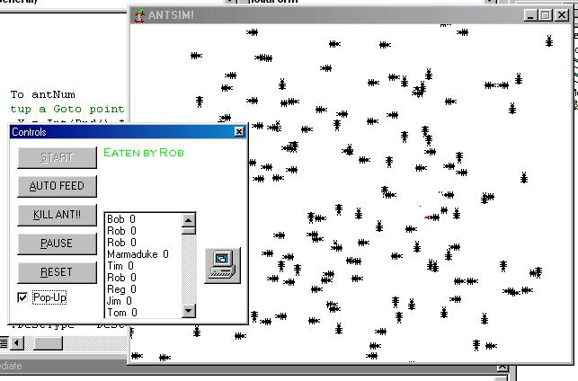

<div align="center">

## ant simulator\!\!\!\! THE SEQUEL\!\!\!\!\!


</div>

### Description

OH MY GOD!!!!!

IT'S THE ALL NEW AND IMPROVED ANT SIMULATOR!!!!!

AND IT'S BEEN IMPROVED AGAIN!!

IMPROVED features including:

*Screen Saver mode (improved)

*(improved) Improved search algorithms

*New form layout (improved)

*Adjustable form (improved) sizing

*Slightly (improved) improved graphical methods

*Lots more.....(improved)

So download today.

Tell your friends, tell their friends. Tell people you meet on the street.

Vote!!

Pass comment!

Tell me to stop with the ants already!

NOW!
 
### More Info
 
None!!!

None!!!

(except ants)

Wasted work time.

New understanding of ants.

Fun.


<span>             |<span>
---                |---
**Submitted On**   |2001-04-28 22:50:30
**By**             |[necromunda](https://github.com/Planet-Source-Code/PSCIndex/blob/master/ByAuthor/necromunda.md)
**Level**          |Intermediate
**User Rating**    |4.4 (127 globes from 29 users)
**Compatibility**  |VB 6\.0
**Category**       |[Games](https://github.com/Planet-Source-Code/PSCIndex/blob/master/ByCategory/games__1-38.md)
**World**          |[Visual Basic](https://github.com/Planet-Source-Code/PSCIndex/blob/master/ByWorld/visual-basic.md)
**Archive File**   |[ant simula189374282001\.zip](https://github.com/Planet-Source-Code/necromunda-ant-simulator-the-sequel__1-22742/archive/master.zip)

### API Declarations

```
Bit blt
sleep
```


